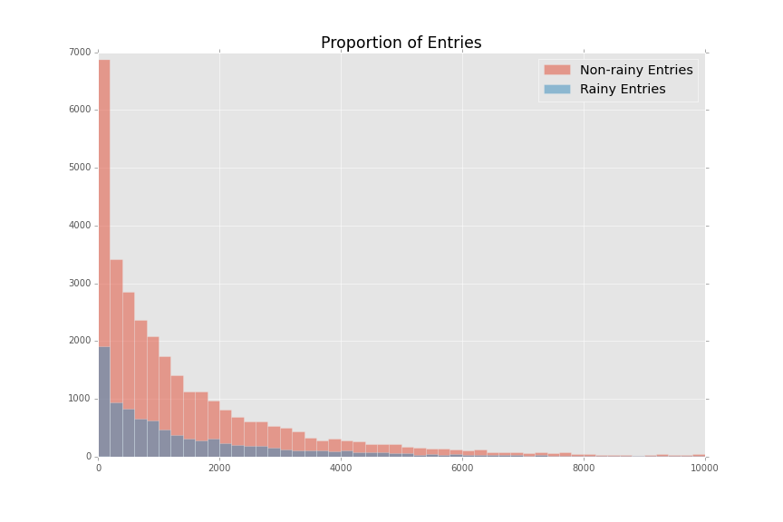

# Section 0. References

https://en.wikipedia.org/wiki/Mann%E2%80%93Whitney_U_test
http://stats.stackexchange.com/questions/116315/problem-with-mann-whitney-u-test-in-scipy#116332
http://blog.minitab.com/blog/adventures-in-statistics/regression-analysis-how-do-i-interpret-r-squared-and-assess-the-goodness-of-fit

# Section 1. Statistical Test

### 1.1 Which statistical test did you use to analyze the NYC subway data? Did you use a one-tail or a two-tail P value? What is the null hypothesis? What is your p-critical value?
I used a Mann-Whitney U-test to analyze the subway/weather data. I did a two tailed test with an alpha of .05. I'm not sure how to calculate a p-critical value for a U distribution, but I used the p-value to test my hypothesis.   

### 1.2 Why is this statistical test applicable to the dataset? In particular, consider the assumptions that the test is making about the distribution of ridership in the two samples.
I would have used a Z-test for this dataset because our sample sizes were much greater than 30, that assumes the data is normally distributed.  
After performing a Shapiro-Wilk test, I found out that this data isn't from a normal distribution, so I had to use a non-parametric test.  The Mann-Whitney test uses the same assumption that we have a large sample (greater than 20), but it assumes nothing about the distribution the sample comes from.  
### 1.3 What results did you get from this statistical test? These should include the following numerical values: p-values, as well as the means for each of the two samples under test.  
average entries with rain: 1105.4463767458733  
average entries without rain: 1090.278780151855  
U: 1924409167.0  
p-value: 0.024999912793489721  

### 1.4 What is the significance and interpretation of these results?
These results show that it is very likely (95%) that the differences in means aren't just by chance.  The average ridership on rainy days in actually higher.

# Section 2. Linear Regression

### 2.1 What approach did you use to compute the coefficients theta and produce prediction for ENTRIESn_hourly in your regression model:
I used both OLS and gradient descent. I thought it would be nice to get familiar with both.
  
### 2.2 What features (input variables) did you use in your model? Did you use any dummy variables as part of your features?
For my Gradient Descent model I used hour, min temp, mean wind speed, and precipitation. I also stuck with the dummy_unit variable that was in there before.

### 2.3 Why did you select these features in your model? We are looking for specific reasons that lead you to believe that the selected features will contribute to the predictive power of your model. Your reasons might be based on intuition. For example, response for fog might be: “I decided to use fog because I thought that when it is very foggy outside people might decide to use the subway more often.” Your reasons might also be based on data exploration and experimentation, for example: “I used feature X because as soon as I included it in my model, it drastically improved my R2 value.”
The hour, temperature, and precipitation were all intuitive. I figured that the entries mostly varied base on time of day and that people don't like cold or rainy weather. The wind just helped improve my R2 value.
  
### 2.4 What are the parameters (also known as "coefficients" or "weights") of the non-dummy features in your linear regression model?
It is a little bit difficult to read (I couldn't figure out how to seperate out the dummy parameters) but I think my parameters are 478.58 -31.24 49.24 5.24 for hour, min temp, mean wind speed, and precipitation respectively.

### 2.5 What is your model’s R2 (coefficients of determination) value?  
My R2 ended up being about 0.4168.

### 2.6 What does this R2 value mean for the goodness of fit for your regression model? Do you think this linear model to predict ridership is appropriate for this dataset, given this R2 value?
It's not great, I just wanted to get to above .4 for the assignment. However, I did find this information on minitab's website:
> In some fields, it is entirely expected that your R-squared values will be low. For example, any field that attempts to predict human behavior, such as psychology, typically has R-squared values lower than 50%. Humans are simply harder to predict than, say, physical processes.

Given that information, I would say that my model is appropriate for this dataset, considering how unpredictable humans can be.

# Section 3. Visualization  
  
### 3.1 One visualization should contain two histograms: one of  ENTRIESn_hourly for rainy days and one of ENTRIESn_hourly for non-rainy days.
  
  
Blue is non-rain and green is rain

### 3.2 One visualization can be more freeform.

# Section 4. Conclusion

Please address the following questions in detail. Your answers should be 1-2 paragraphs long.  
### 4.1 From your analysis and interpretation of the data, do more people ride the NYC subway when it is raining or when it is not raining?    
More people ride the subway when it is raining.  
I feel confident saying this because of the results of the statistical tests performed (see below). Subways are an easy way to get around when it is raining, and it makes sense that most people don't want to get wet.
When I was in Manhattan, things seemed fairly close, so the distance didn't bother me, but not having to walk in the rain (even for a short distance) can be worth the subway ticket for many people. There was also evidence from the linear
model to suggest that temperature and wind speed had something to do with it to. Bad weather means good public transit sales.

### 4.2 What analyses lead you to this conclusion? You should use results from both your statistical tests and your linear regression to support your analysis.
As discussed in Section 1, the Mann-Whitney test showed statistical significance at .05 that rainy/non-rainy days are different. This means that we
can be 95% sure that they aren't different by chance &mdash; there must be a reason for the difference. Looking at the differences in means for rainy/non-rainy days
leads us to conclude that not only is the average for rainy days higher, but rainy days on average will be higher in the long run.  
The inputs chosen for the linear model also helped show that other weather factors had an effect. I don't have the normalized coefficients, but a quick glance at the non-normalized ones
suggest that the wind speed and temperature were just as big of a part of the model as the precipitation.

# Section 5. Reflection

Please address the following questions in detail. Your answers should be 1-2 paragraphs long.  
### 5.1 Please discuss potential shortcomings of the methods of your analysis, including: Dataset, Analysis, such as the linear regression model or statistical test.  
One of the biggest shortcomings with the linear regression is that I don't know for sure if I reached a global optimum. Using gradient descent, I was able to get a quicker answer for more parameters. Looking back, choosing a limited set of parameters
and using an ordinary least squares approach would have given me a better model.  
The Mann-Whitney U-test is a robust test that does very well with data that isn't normally-distributed. After some research, I couldn't find any real shortcomings of the test overall. However, the fact that I just picked
.05 as the alpha for my test can come under some scrutiny. More practice and familiarity in the area would help me decide if that was a good
significance value or not.
